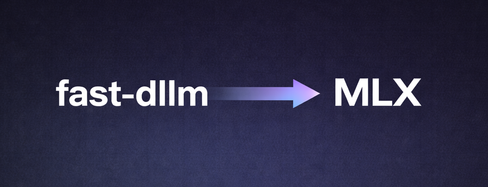
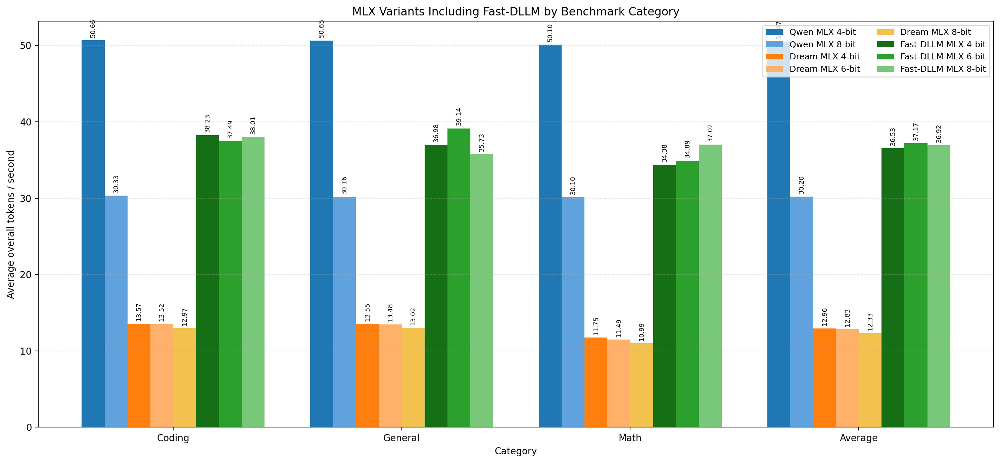

# Fast-dLLM-mlx

`Fast-dLLM-mlx` implements Dream architecture inference in MLX for Apple Silicon.

This repository is an MLX implementation of the first Fast-dLLM ideas from the
[NVLabs/Fast-dLLM](https://github.com/NVlabs/Fast-dLLM) project, adapted for
Dream-style diffusion language models. The focus here is training-free
inference speedups for Dream models running on MLX.

The current implementation includes:

- Dream architecture inference in MLX
- A first MLX version of the Fast-dLLM approach from the original NVLabs repo
- Dual-cache support for more efficient decoding
- Parallel token generation with probability thresholding

The repository also includes small benchmark scripts used to compare MLX
variants across the prompts in [`prompts/`](/Users/ruiite/projects/Fast-dLLM-mlx/prompts).

## Install

```bash
uv sync
```

or

```bash
pip install -e .
```

## Basic Usage

Run the Fast-dLLM MLX benchmark:

```bash
uv run python -m benchmarks.fast_dllm_mlx_benchmark \
  --model mlx-community/DiffuCoder-7B-cpGRPO-8bit \
  --trust-remote-code \
  --max-new-tokens 128 \
  --steps 20 \
  --block-length 32 \
  --threshold 0.9 \
  --warmup
```

To print the generated response for each prompt while benchmarking use flag:

```bash
  --print-response
```

Run the Dream MLX benchmark:

```bash
uv run python -m benchmarks.dream_mlx_benchmark \
  --model mlx-community/DiffuCoder-7B-cpGRPO-8bit \
  --trust-remote-code \
  --max-new-tokens 128 \
  --steps 20 \
  --use-compile
```

Run the Qwen `mlx_lm` benchmark:

```bash
uv run python -m benchmarks.qwen_mlx_lm_benchmark \
  --model mlx-community/Qwen2.5-Coder-7B-Instruct-8bit \
  --max-new-tokens 128 \
  --temp 0.0 \
  --top-p 1.0 \
  --warmup
```


All benchmark scripts write CSV and JSON summaries by default, and you can point
them at a custom prompt set with `--prompt-file`.

## Benchmarks

The repo includes benchmark entrypoints for the main comparison paths:

- [`benchmarks/fast_dllm_mlx_benchmark.py`](/Users/ruiite/projects/Fast-dLLM-mlx/benchmarks/fast_dllm_mlx_benchmark.py)
- [`benchmarks/dream_mlx_benchmark.py`](/Users/ruiite/projects/Fast-dLLM-mlx/benchmarks/dream_mlx_benchmark.py)
- [`benchmarks/qwen_mlx_lm_benchmark.py`](/Users/ruiite/projects/Fast-dLLM-mlx/benchmarks/qwen_mlx_lm_benchmark.py)

The benchmark prompts currently come from the limited sample set in
[`prompts/`](/Users/ruiite/projects/Fast-dLLM-mlx/prompts), so the reported
numbers should be treated as directional rather than exhaustive.

## Results

The comparison below was run on a limited amount of samples from the
[`prompts/`](/Users/ruiite/projects/Fast-dLLM-mlx/prompts) folder.

For the MLX version of the Dream architecture, this repository uses [DiffuCoder](https://github.com/apple/ml-diffucoder).

 We include Qwen2.5-Coder in the comparison because the Dream architecture used here is based on Qwen2.5, and using the coder variant makes the comparison with DiffuCoder more reliable.



In this benchmark slice, the Fast-dLLM MLX variants are substantially faster
than the Dream MLX variants. Among the Qwen `mlx_lm` baselines, only the 4-bit
variant outperforms Dream with Fast-dLLM on MLX. These numbers are useful for a
quick relative comparison, but they are not a full evaluation across larger
prompt sets or different generation settings.
